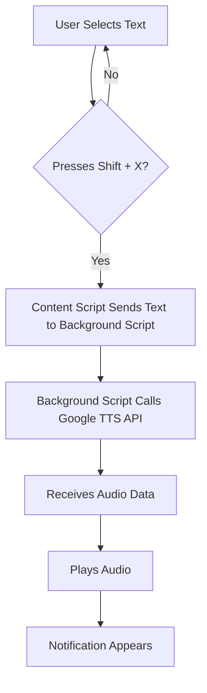

# Google Text-to-Speech Extension: Chirp 3 HD & Gemini-TTS

A Firefox extension that reads selected text aloud using Google's advanced TTS engines with a simple keyboard shortcut (Shift + X). Choose between ultra-realistic Chirp 3 HD voices or the new Gemini-TTS with advanced style control.

## Table of Contents
- [Features](#features)
- [Setup Instructions](#setup-instructions)
  - [1. Get Google Cloud Text-to-Speech API Key](#1-get-google-cloud-text-to-speech-api-key)
  - [2. Install the Extension](#2-install-the-extension)
  - [3. Configure the Extension](#3-configure-the-extension)
- [How to Use](#how-to-use)
- [TTS Engines](#tts-engines)
  - [Chirp 3 HD](#chirp-3-hd)
  - [Gemini-TTS](#gemini-tts)
- [Technical Details](#technical-details)
  - [File Structure](#file-structure)
  - [Permissions Used](#permissions-used)
- [Troubleshooting](#troubleshooting)
  - [Common Issues](#common-issues)
  - [Browser Compatibility](#browser-compatibility)
- [Security Notes](#security-notes)
- [Future Enhancements](#future-enhancements)
- [License](#license)
- [Support](#support)

## Features

- 🔊 Read selected text aloud with Shift + X hotkey
- 🎭 **Dual TTS Engines**: Choose between Chirp 3 HD or Gemini-TTS
- 🎯 **Gemini-TTS**: Advanced style control with text prompts
- 🗣️ **30+ Voices**: Wide selection of male and female voices
- ⚡ Speed control (0.25x to 2.0x)
- 🔐 Secure API key storage
- 📱 Tab-based interface for easy engine switching
- 🌐 Works on all websites
- 🎨 Control tone, emotion, and speaking style with prompts (Gemini-TTS)

## Setup Instructions

### 1. Get Google Cloud Text-to-Speech API Key

1. Go to [Google Cloud Console](https://console.cloud.google.com/)
2. Create a new project or select an existing one
3. Enable the **Cloud Text-to-Speech API**:
   - Navigate to "APIs & Services" > "Library"
   - Search for "Cloud Text-to-Speech API"
   - Click on it and press "Enable"
   - **Note**: Both Chirp 3 HD and Gemini-TTS are available in supported regions
4. Create an API key:
   - Go to "APIs & Services" > "Credentials"
   - Click "Create Credentials" > "API Key"
   - Copy the generated API key
   - (Optional) Restrict the API key to only Text-to-Speech API for security

### 2. Install the Extension

#### Option A: Load as Temporary Add-on (for testing)
1. Open Firefox
2. Navigate to `about:debugging`
3. Click "This Firefox"
4. Click "Load Temporary Add-on..."
5. Select the `manifest.json` file from this project directory
6. The extension will be loaded temporarily

#### Option B: Package for permanent installation (using `package.bat`)
1. Run the `package.bat` script (e.g., by double-clicking it or executing `package.bat` from your command line) in the project directory. This will create a `firefox-tts-extension` folder containing all necessary extension files.
2. Manually zip the *contents* of the newly created `firefox-tts-extension` folder (not the folder itself).
3. Rename the generated `.zip` file to have a `.xpi` extension (e.g., `firefox-tts-extension.xpi`).
4. Open Firefox and drag the `.xpi` file into the browser.
5. Follow the installation prompts to install the extension permanently.

### 3. Configure the Extension

1. Click the extension icon in the Firefox toolbar
2. Enter your Google Cloud API key in the popup
3. Click "Save API Key"
4. Test the functionality using the test section in the popup

## How to Use
## TTS Engines

This extension supports two powerful Google TTS engines. You can switch between them using the tab interface in the extension popup.

### Chirp 3 HD

**Overview**: Ultra-realistic AI voices with natural-sounding speech synthesis.

**Features**:
- High-definition voice quality
- 4 UK English voices available
- Sample rate up to 48000 Hz
- Speed control (0.25x - 2.0x)

**Available Voices**:
- Charon (Male)
- Kore (Female)
- Leda (Female)
- Puck (Male)

**Best for**: General text-to-speech needs, audiobooks, content reading

### Gemini-TTS

**Overview**: The latest evolution of Google's TTS technology with granular control over generated audio using text-based prompts.

**Features**:
- **Style Control**: Use natural language prompts to control tone, emotion, and delivery
- **30 Voice Options**: Wide selection of distinct male and female voices
- **Two Models**:
  - **Flash** (`gemini-2.5-flash-preview-tts`): Fast and cost-efficient for everyday applications
  - **Pro** (`gemini-2.5-pro-preview-tts`): High quality for complex prompts and professional use
- **Dynamic Performance**: Can express emotions, accents, and specific tones
- **Enhanced Control**: Adjust pace, pronunciation, and speaking style via prompts

**Available Voices**:

*Female Voices*: Achernar, Aoede, Autonoe, Callirrhoe, Despina, Erinome, Gacrux, Kore, Laomedeia, Leda, Pulcherrima, Sulafat, Vindemiatrix, Zephyr

*Male Voices*: Achird, Algenib, Algieba, Alnilam, Charon, Enceladus, Fenrir, Iapetus, Orus, Puck, Rasalgethi, Sadachbia, Sadaltager, Schedar, Umbriel, Zubenelgenubi

**Prompt Examples**:
- `"Say this in a friendly and casual way"`
- `"Read this like a news anchor"`
- `"Say this with excitement and enthusiasm"`
- `"Speak in a calm, professional tone"`
- `"Say this very fast but still be intelligible"`

**Best for**: 
- Conversational applications
- Content requiring specific emotional tone
- Podcasts and storytelling
- Customer support scenarios
- Creative voice applications

**Supported Languages**: 80+ locales including English (US, UK, AU, IN), Spanish, French, German, Japanese, Korean, and many more.


1. **Select text** on any webpage by highlighting it with your mouse
2. **Press Shift + X** while the text is selected
3. The extension will read the selected text aloud using UK English voice
4. A notification will appear to confirm the action

## Technical Details

### File Structure
```
firefox-speech-extension/
├── manifest.json          # Defines the extension's metadata, permissions, and entry points.
├── content.js            # Injects into web pages to handle text selection and keyboard shortcuts (Shift + X).
├── background.js         # Runs in the background, handles API calls to Google Cloud Text-to-Speech, and manages audio playback.
├── popup.html           # The HTML structure for the extension's popup interface.
├── popup.js             # Contains the JavaScript logic for the popup, handling API key input and testing.
├── config.js            # Stores configuration settings, such as the default voice and speed.
└── README.md            # This documentation file.
```

### Engine Configuration

The extension supports two TTS engines that can be switched via the tab interface:

**Chirp 3 HD (Default)**:
- Language: English (UK) - `en-GB`
- Default Voice: Charon (Male)
- Speed: 0.25x to 2.0x (default: 1.0x)
- Audio Format: OGG_OPUS
- Sample Rate: 24000 Hz or 48000 Hz

**Gemini-TTS**:
- Language: Multiple (80+ locales, default: en-US)
- Default Voice: Kore (Female)
- Models: Flash (fast) or Pro (high quality)
- Speed: 0.25x to 2.0x (default: 1.0x)
- Audio Format: LINEAR16
- Prompt Support: Optional style instructions

### Permissions Used
- `activeTab`: Access to current webpage for text selection
- `storage`: Store API key securely
- `https://texttospeech.googleapis.com/*`: Access to Google TTS API

## Diagrams

Here's a simple flowchart illustrating the extension's core process:



## Troubleshooting

### Common Issues

1. **"No text selected" message**
   - Make sure you have selected text before pressing Shift + X
   - Try selecting the text again

2. **"Google API key not configured" error**
   - Open the extension popup and enter your API key
   - Make sure the API key is valid and has Text-to-Speech API enabled

3. **"API Error" messages**
   - Check that your Google Cloud project has Text-to-Speech API enabled
   - Verify your API key is correct and not expired
   - Ensure you have quota/credits available in your Google Cloud account
   - Verify your project has access to the selected TTS engine (Chirp 3 HD or Gemini-TTS)
   - Try switching between engines to see if one works better

4. **No audio playback**
   - Check your browser's audio settings
   - Make sure the website allows audio playback (some sites block autoplay)
   - Try testing with the built-in test function in the popup for both engines
   - Switch between Chirp 3 HD and Gemini-TTS tabs to test different engines

5. **Gemini-TTS specific issues**
   - If prompts aren't working as expected, try simplifying your prompt
   - Ensure prompt length is reasonable (under 900 bytes)
   - Try different voices to find one that works best with your prompt style

### Browser Compatibility
- Designed for Firefox (manifest v2)
- Requires Firefox 60+ for full compatibility

## Security Notes

- API keys are stored locally in Firefox's secure storage
- No data is sent to third parties except Google's TTS API
- Selected text is only sent to Google for speech synthesis
- API keys are masked in the UI for security

## Future Enhancements

- ✅ **Completed**: Dual engine support (Chirp 3 HD + Gemini-TTS)
- ✅ **Completed**: Multiple voice options (30+ voices)
- ✅ **Completed**: Style control via prompts (Gemini-TTS)
- Multi-speaker dialogue support (Gemini-TTS advanced feature)
- Custom pronunciation support
- Custom hotkey configuration
- Audio controls (pause, stop, resume)
- Streaming synthesis for longer texts
- Language auto-detection

## License

This project is open source. Feel free to modify and distribute according to your needs.

## Support

If you encounter issues:
1. Check the browser console for error messages
2. Verify your Google Cloud setup
3. Test with the built-in test function
4. Check Firefox's extension debugging tools at `about:debugging`