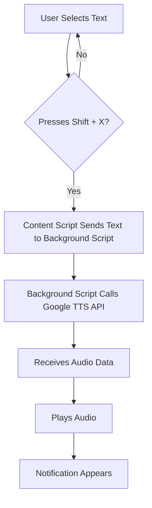

# Firefox Chirp 3 HD Text-to-Speech Extension

A Firefox extension that reads selected text aloud using Google's ultra-realistic Chirp 3 HD voices with a simple keyboard shortcut (Shift + X).

## Table of Contents
- [Features](#features)
- [Setup Instructions](#setup-instructions)
  - [1. Get Google Cloud Text-to-Speech API Key (Chirp 3 HD)](#1-get-google-cloud-text-to-speech-api-key-chirp-3-hd)
  - [2. Install the Extension](#2-install-the-extension)
  - [3. Configure the Extension](#3-configure-the-extension)
- [How to Use](#how-to-use)
- [Technical Details](#technical-details)
  - [File Structure](#file-structure)
  - [Voice Configuration (Chirp 3 HD)](#voice-configuration-chirp-3-hd)
  - [Permissions Used](#permissions-used)
- [Troubleshooting](#troubleshooting)
  - [Common Issues](#common-issues)
  - [Browser Compatibility](#browser-compatibility)
- [Security Notes](#security-notes)
- [Future Enhancements](#future-enhancements)
- [License](#license)
- [Support](#support)

## Features

- 🔊 Read selected text aloud with Shift + X hotkey
- 🇬🇧 Ultra-realistic UK English voice (Chirp 3 HD - Charon)
- ⚡ Speed control (0.25x to 2.0x, currently set to normal: 1.0)
- 🔐 Secure API key storage
- 📱 Simple popup interface for configuration
- 🌐 Works on all websites
- 🎭 Powered by Google's most advanced AI voices

## Setup Instructions

### 1. Get Google Cloud Text-to-Speech API Key (Chirp 3 HD)

1. Go to [Google Cloud Console](https://console.cloud.google.com/)
2. Create a new project or select an existing one
3. Enable the **Cloud Text-to-Speech API**:
   - Navigate to "APIs & Services" > "Library"
   - Search for "Cloud Text-to-Speech API"
   - Click on it and press "Enable"
   - **Important**: Ensure your project has access to Chirp 3 HD voices (available in global, us, eu, asia-southeast1 regions)
4. Create an API key:
   - Go to "APIs & Services" > "Credentials"
   - Click "Create Credentials" > "API Key"
   - Copy the generated API key
   - (Optional) Restrict the API key to only Text-to-Speech API for security

### 2. Install the Extension

#### Option A: Load as Temporary Add-on (for testing)
1. Open Firefox
2. Navigate to `about:debugging`
3. Click "This Firefox"
4. Click "Load Temporary Add-on..."
5. Select the `manifest.json` file from this project directory
6. The extension will be loaded temporarily

#### Option B: Package for permanent installation (using `package.bat`)
1. Run the `package.bat` script (e.g., by double-clicking it or executing `package.bat` from your command line) in the project directory. This will create a `firefox-tts-extension` folder containing all necessary extension files.
2. Manually zip the *contents* of the newly created `firefox-tts-extension` folder (not the folder itself).
3. Rename the generated `.zip` file to have a `.xpi` extension (e.g., `firefox-tts-extension.xpi`).
4. Open Firefox and drag the `.xpi` file into the browser.
5. Follow the installation prompts to install the extension permanently.

### 3. Configure the Extension

1. Click the extension icon in the Firefox toolbar
2. Enter your Google Cloud API key in the popup
3. Click "Save API Key"
4. Test the functionality using the test section in the popup

## How to Use

1. **Select text** on any webpage by highlighting it with your mouse
2. **Press Shift + X** while the text is selected
3. The extension will read the selected text aloud using UK English voice
4. A notification will appear to confirm the action

## Technical Details

### File Structure
```
firefox-speech-extension/
├── manifest.json          # Defines the extension's metadata, permissions, and entry points.
├── content.js            # Injects into web pages to handle text selection and keyboard shortcuts (Shift + X).
├── background.js         # Runs in the background, handles API calls to Google Cloud Text-to-Speech, and manages audio playback.
├── popup.html           # The HTML structure for the extension's popup interface.
├── popup.js             # Contains the JavaScript logic for the popup, handling API key input and testing.
├── config.js            # Stores configuration settings, such as the default voice and speed.
└── README.md            # This documentation file.
```

### Voice Configuration (Chirp 3 HD)
- **Language**: English (UK) - `en-GB`
- **Voice**: `en-GB-Chirp3-HD-Charon` (Ultra-realistic Male UK voice)
- **Speed**: 1.0 (normal speed, adjustable 0.25x to 2.0x)
- **Audio Format**: MP3
- **Technology**: Powered by Google's latest LLM-based speech synthesis

### Permissions Used
- `activeTab`: Access to current webpage for text selection
- `storage`: Store API key securely
- `https://texttospeech.googleapis.com/*`: Access to Google TTS API

## Diagrams

Here's a simple flowchart illustrating the extension's core process:



## Troubleshooting

### Common Issues

1. **"No text selected" message**
   - Make sure you have selected text before pressing Shift + X
   - Try selecting the text again

2. **"Google API key not configured" error**
   - Open the extension popup and enter your API key
   - Make sure the API key is valid and has Text-to-Speech API enabled

3. **"API Error" messages**
   - Check that your Google Cloud project has Text-to-Speech API enabled
   - Verify your API key is correct and not expired
   - Ensure you have quota/credits available in your Google Cloud account
   - **Important**: Verify your project has access to Chirp 3 HD voices in supported regions

4. **No audio playback**
   - Check your browser's audio settings
   - Make sure the website allows audio playback (some sites block autoplay)
   - Try testing with the built-in test function in the popup

### Browser Compatibility
- Designed for Firefox (manifest v2)
- Requires Firefox 60+ for full compatibility

## Security Notes

- API keys are stored locally in Firefox's secure storage
- No data is sent to third parties except Google's TTS API
- Selected text is only sent to Google for speech synthesis
- API keys are masked in the UI for security

## Future Enhancements

- Settings page for voice selection (supporting all 8 Chirp 3 HD voices across 31 languages)
- Pace and pause control features
- Custom pronunciation support
- Custom hotkey configuration
- Audio controls (pause, stop, resume)
- Streaming synthesis for longer texts

## License

This project is open source. Feel free to modify and distribute according to your needs.

## Support

If you encounter issues:
1. Check the browser console for error messages
2. Verify your Google Cloud setup
3. Test with the built-in test function
4. Check Firefox's extension debugging tools at `about:debugging`